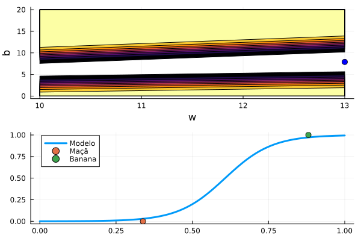
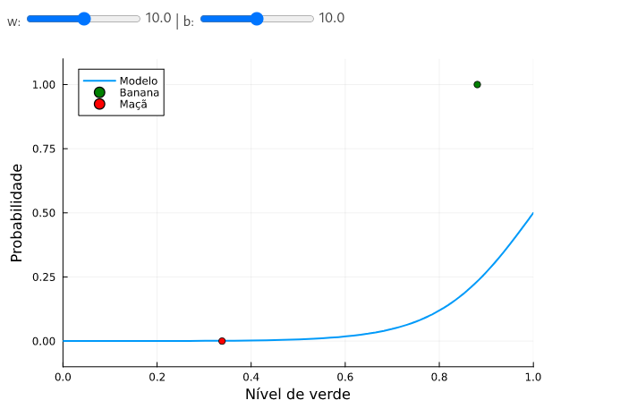

# Introdução ao Machine Learning
O notebook criado usando linguagem Juia e a ferramenta Pluto.jl demonstra como programar um simples neurônio usando uma função sigmóide como modelo matemático. Pluto.jl permite que possamos criar interações com diversos componentes de interface gráfica como sliders, checkboxes, etc. No notebook está presente um simulador de neurônio que torna possível entender visualmente como o modelo funciona.

